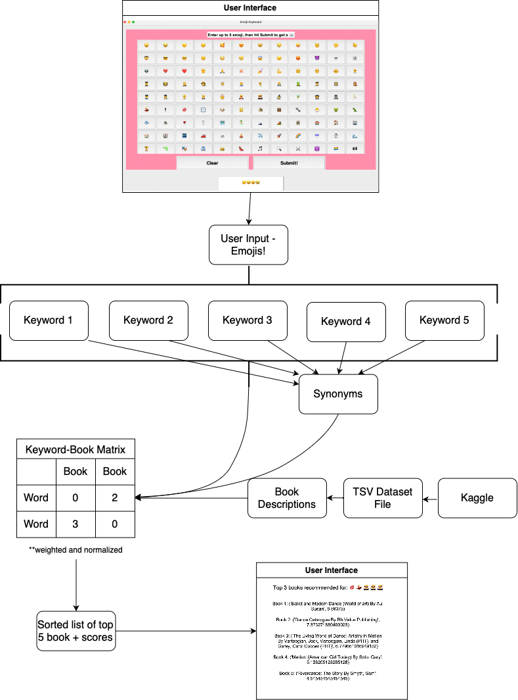

# DSAN-5400-emoji-project
Final project for Spring 2025 DSAN-5400 by Shivani Ramesh, Lillian Ehrhart, and Isabelle Reilly

# 📚 Emoji Book Recommender
---

## Project Description

This **Emoji Book Recommender** is a Python-based tool that lets users find books with an emoji query. The driving question behind this project was: How can we create a unique, interesting way to recommend books to the user? 

In some areas, a user might not have fully articulated keywords in mind for a search. One case of that is looking for something new to read! Users might not know exactly what topic they’re looking for, exactly what genre or age range they want, or have a specific title or author in mind. But they tend to have at least light preferences in some of these areas. Our idea, then, is to experiment with a fun, engaging method of input in a context where precision may not be the goal for the user.

This project takes a new look at the NLP task of information retrieval. We use:
- A manually annotated emoji-to-keyword mapping
- A book dataset from Kaggle with descriptions of each book
- A term-document matrix that retrieves the closest matching book to the query

- Also included are several "dormant" files which are not a part of the main UI, but can be used to operate the software with a user-chosen dataset of books. To operate these other utility files, users will need to run them using the command line, putting in file paths as arguments.
---

## How To Use

### Generating Keyword-Book Matrix:
Note: This should be done before running main. 
Run emoji_book_rec/emoji_book_rec/utils/create_kw_book_tsv.py. The file contains an optional argument, "filepath," which allows the user to use their own dataset. If none is specified, a default from Kaggle will be used. 

### User Interface:
1. Launch the GUI
2. Select up to 5 emoji from the emoji keyboard (you can use multiple of any emoji to weight your search more to that emoji!)
3. Submit your emoji query
4. Receive back a list of recommended books based on the emoji input

### Back-end Flow:
- Each emoji maps to 5 curated keywords (with the first one weighted extra to ensure more topical results)
- Book descriptions are indexed into a keyword matrix (supporting synonyms via WordNet).
- Emoji keywords are matched to the matrix and used to rank books by relevance.
- Scores from the index are then weighted based on how many different keywords were found in a given book description, as a way to take the entire contents of the query into account.
- A sorted list of 5 recommendations is returned in the GUI.
- The software logs messages throughout, which are output to the logging file. This includes the top 25 results of the search for extra data.

---

## Workflow diagram

